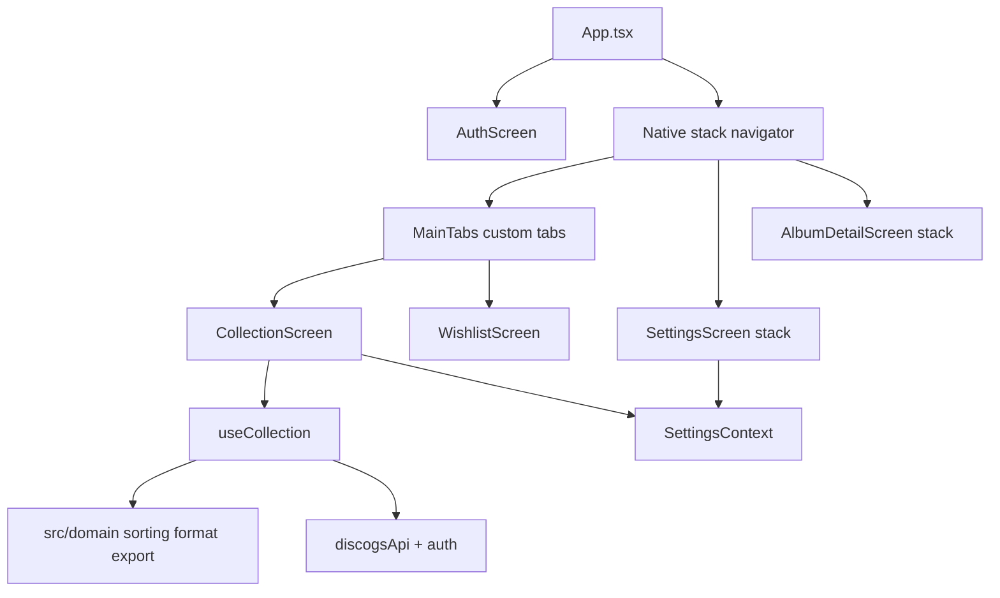

# Mobile app handoff summary

**Repo:** [Jon1969Edwards/discogs-vinyl-sorter-mobile](https://github.com/Jon1969Edwards/discogs-vinyl-sorter-mobile)  
**Product name:** **Spindle** (display / User-Agent). Native `scheme` / package ids remain `discogvinylsorter` for OAuth continuity.  
**Active branch:** `develop` (feature work); **`main`** tracks releases (merged with `develop` at `4580814` and later)  
**Windows reference commit:** `86532026d340a5ce85b9f974db4a25b003c0ebe7` (`discogs-vinyl-sorter-windows` / `develop`)

---

## Executive summary

The mobile app is an **Expo SDK 54** port of the **Windows Auto-Sort GUI** collection pipeline: fetch all releases from Discogs, classify formats, filter by user-selected formats (default LP), sort with the same last-name-first / GUI build rules as Windows, optionally attach marketplace prices, apply manual order overrides, cache results, and export TXT/CSV/JSON with letter or ABC shelf dividers.

**Phases A–D are implemented** in code and covered by **47 Jest tests** (domain golden tests plus cache, settings, price formatting, collection notes, licensing/gates, genre overrides). **Phase E (store/EAS polish)** is partially done — see `docs/EAS_RELEASE.md` and `docs/STORE_LISTING.md`.

**Post-parity mobile work:** Spindle branding; Free/Pro with shared `VSS1` keys; richer album detail (wishlist, Spotify, cached prices); durable exports under Documents; parallel marketplace price fetch + 7-day price cache; currency dropdown; collection header/search/pull-to-refresh.

Pre-existing: **PAT + OAuth** in SecureStore, **custom Collection/Wishlist tabs**, stack **Settings** / **album detail**, Android dev-client scripts (`npm run android`).

---

## Quick start (next developer)

```bash
cd F:\Dev\discogs-vinyl-sorter-mobile
git checkout develop
npm install
npm test          # 41 tests — run after any domain / licensing change
npm run start:lan # Dev client + LAN Metro (preferred on device)
npm run android   # Local emulator via scripts/run-android.js (often unavailable on Windows)
```

**Auth (pick one):**

| Method | Setup |
|--------|--------|
| **PAT** | Auth screen → Advanced → paste token; validated via `getIdentity` before save |
| **OAuth** | `.env` with `DISCOGS_CONSUMER_KEY` / `DISCOGS_CONSUMER_SECRET`; Discogs callback `discogvinylsorter://callback` — see `docs/OAUTH_SETUP.md` |

**Device smoke test before release:** `docs/SMOKE_TEST_CHECKLIST.md`

**Release build (standalone APK/AAB):** `docs/EAS_RELEASE.md`

---

## App architecture (current `develop`)



| Layer | Location | Notes |
|-------|----------|--------|
| Entry | `index.ts` | Imports `react-native-gesture-handler` + `react-native-reanimated` first |
| Settings (single source) | `src/context/SettingsContext.tsx` | `AppSettings` in AsyncStorage via `src/services/settings.ts` |
| ~~Legacy~~ | ~~`src/contexts/SettingsContext.tsx`~~ | **Removed** — use `src/context/SettingsContext.tsx` only |
| Collection pipeline | `src/hooks/useCollection.ts` | Windows GUI path: fetch-all → `collectAllRows` → format filter → prices → `sortRows` → `applyManualOrder` → cache |
| Domain (tested) | `src/domain/*.ts` | Port of `core/sorting.py`, `format_filter.py`, `export.py` |
| Licensing | `src/services/licensing.ts`, `featureGate.ts` | Same `VSS1` HMAC keys as Windows; SecureStore/AsyncStorage license |
| Auth | `src/services/auth.ts` | `DiscogsCredentials`: `{ type: 'pat' }` or `{ type: 'oauth', token, secret }` |

**Navigation UX:** Collection and Wishlist share a **custom bottom tab bar** (`src/navigation/MainTabs.tsx`). **Settings** and **album detail** are **stack screens** pushed from Collection (not a third tab). This differs from the short-lived `main`-only bottom-tabs layout (Shelf | Wishlist | Settings).

---

## Parity contract (behavioral)

1. **Collection:** Fetch all folder-0 releases → tag `format_categories` → filter by saved `formats` (default `['lp']`) → sort with GUI build options (`lastNameFirst`, `lnfSafeBands`, `lnfAllow3=false`, `variousPolicy=normal` from `GUI_BUILD_SORT` in `src/types/index.ts`).
2. **Export:** TXT / CSV / JSON aligned with Windows `core/export.py`; `divider_mode`: `none` | `letter` | `abc`. When `sort_by` is `genre`, TXT uses `=== Jazz ===` section headers (letter/ABC ignored).
3. **Config** (AsyncStorage key `discogs_app_settings`): `formats`, `divider_mode`, `sort_by` (`artist` | `title` | `year` | `genre` | `price_asc` | `price_desc`), `currency`, `write_json`, `poll_seconds`, `show_prices`, `save_last_export`, `user_agent`, `per_page`.
3b. **Genre edits:** AsyncStorage `spindle_genre_overrides` (Windows `genre_overrides.json`). Album detail **Edit genre**; survives Discogs refresh.
4. **Pro:** Free capped at 100 records; prices, manual order, and ABC dividers require Pro (`VSS1` key). Soft upsell modals.
5. **Wishlist:** Local entries + sync from Discogs wantlist during collection build (best-effort).
6. **Cache:** Full row cache per username; collection item count for stale detection; 7-day price TTL in cache service; last sync timestamp on stale banner.
7. **Prices:** Marketplace stats when Pro + `show_prices` or price sort; concurrent fetch + per-currency cache; list rows show price when enabled (`formatListPrice`).
8. **Export:** Share sheet + optional durable copy under `Documents/exports/spindle_shelf_order.*`.

---

## File mapping (Windows → Mobile)

| Windows | Mobile |
|---------|--------|
| `core/sorting.py` | `src/domain/sorting.ts`, `src/domain/genre.ts` |
| `core/export.py` | `src/domain/export.ts` |
| `core/genre_overrides.py` | `src/services/genreOverrides.ts` |
| `core/api.py` | `src/services/discogsApi.ts` |
| `core/oauth_discogs.py` | `src/services/oauthDiscogs.ts` |
| `core/build_service.py` (cache, count) | `src/services/collectionCache.ts`, `src/hooks/useCollection.ts` |
| `autosort_gui.py` ManualOrderManager | `src/services/manualOrder.ts` |
| `core/wishlist.py` | `src/services/wishlist.ts` |
| `gui/settings_panel.py` | `src/screens/SettingsScreen.tsx` |
| `gui/wishlist_panel.py` | `src/screens/WishlistScreen.tsx` |
| `gui/thumbnails.py` | `src/services/thumbnailCache.ts` |
| `.discogs_config.json` | AsyncStorage `discogs_app_settings` |
| Token / OAuth storage | `src/services/auth.ts` (SecureStore native, localStorage web) |
| `core/licensing.py` / `feature_gate.py` | `src/services/licensing.ts`, `featureGate.ts` |
| `core/spotify_utils.py` | `src/utils/spotify.ts` |
| `gui/license_dialog.py` | `src/components/LicenseModal.tsx` |
| Export files | `src/services/exportShare.ts` (share + Documents/exports) |
| `test_sorting.py` | `__tests__/sorting.test.ts` |
| `test_export_dividers.py` | `__tests__/exportDividers.test.ts` |
| `test_genre_overrides.py` | `__tests__/genreOverrides.test.ts` |
| — | `__tests__/collectionCache.test.ts`, `settings.test.ts`, `formatPrice.test.ts`, `collectionNotes.test.ts`, `licensing.test.ts` |

Windows sibling doc (optional): `discogs-vinyl-sorter-windows/docs/MOBILE_PARITY.md` → links here.

---

## Phase checklist

### Phase A — Domain + tests
- [x] `src/domain/` sorting, formatFilter, export (ABC dividers)
- [x] Jest golden tests (30 passing)
- [x] `useCollection` fetch-all → filter → GUI sort

### Phase B — Settings + auth
- [x] Settings screen + AsyncStorage (`AppSettings`)
- [x] OAuth (`expo-web-browser`, `discogvinylsorter://callback`)
- [x] PAT validated with `getIdentity` before save
- [x] Develop auth: PAT + OAuth credentials object (not token-only)

### Phase C — Collection UX
- [x] Collection list + section dividers (letter mode)
- [x] Stack album detail (`AlbumDetailScreen`) — wishlist, Spotify, Pro prices, thumb cache
- [x] Export TXT/CSV/JSON from Collection (share + durable Documents copy)
- [x] Thumbnail cache service (wired on album detail)
- [x] **UI:** Manual reorder (`react-native-draggable-flatlist`) in `CollectionScreen` (Reorder / Done / Reset) — Pro-gated
- [x] **UI:** `CollectionHeader`, `CollectionSearchBar`, pull-to-refresh, load progress
- [x] **UI:** List prices when Pro + `show_prices` enabled
- [x] **UI:** Currency picker + Done/save in `SettingsScreen`
- [x] **UI:** Free/Pro license + soft upsell
- [x] Removed unused `AlbumDetailModal.tsx`

### Phase D — Watch + cache
- [x] Collection cache + item count
- [x] Wishlist sync on build
- [x] **UI:** `useCollectionWatch` mounted in `CollectionScreen` (poll + foreground resume)

### Phase E — Release hardening
- [x] EAS profiles in `eas.json` + release guide (`docs/EAS_RELEASE.md`)
- [x] Store listing draft + privacy policy (`docs/STORE_LISTING.md`, `docs/PRIVACY_POLICY.md`)
- [x] Device smoke checklist (`docs/SMOKE_TEST_CHECKLIST.md`)
- [ ] First successful `eas build` on `preview` or `production` profile (run locally; requires EAS login + secrets)
- [x] Handoff documentation (this file)
- [x] README / `.env.example` callback URL aligned with `oauthDiscogs.ts` (`discogvinylsorter://callback`)

---

## Expo / native notes

| Topic | Detail |
|-------|--------|
| **Reanimated 4** | Requires `react-native-worklets@0.5.1` (Expo Go match), `babel-preset-expo@~54`, and `import 'react-native-reanimated'` in `index.ts` |
| **Expo Go** | **Not supported** for this repo (`expo-dev-client` + gesture-handler / reanimated). Use dev client only. |
| **Dev client** | `npm run android` (first time / after native deps), then `npm start` (`--dev-client`) and open the **Spindle** app — not Expo Go |
| **Sort order** | Last-name-first matches Windows GUI (e.g. Bryan Adams before Alphaville by shelf letter) — not a bug |

---

## Known intentional differences (Windows vs mobile)

| Windows | Mobile |
|---------|--------|
| `vinyl_shelf_order.txt` on disk | Share sheet (`expo-sharing`) |
| OAuth `http://127.0.0.1:8765/callback` | `discogvinylsorter://callback` |
| CustomTkinter settings panel | Stack `SettingsScreen` |
| Treeview drag reorder | Draggable list in `CollectionScreen` |
| Print via Notepad | Not available |
| Obfuscated JSON config | SecureStore + AsyncStorage |

---

## Test commands

**Mobile:**

```bash
npm install
npm test
```

**Windows** (when validating a paired change):

```bash
python test_sorting.py
python test_format_filter.py
python test_export_dividers.py
```

**Sync protocol:** Change Windows `core/` + tests → port `src/domain/` → update `__tests__/*.test.ts` → run both test suites in one session.

---

## Suggested follow-ups (priority)

1. **Push `develop`** to `origin` after smoke test on device.
2. ~~Wire **`useCollectionWatch`**~~ — done in `CollectionScreen`.
3. ~~Wire **manual reorder** UI~~ — done in `CollectionScreen`.
4. ~~Remove legacy **`src/contexts/SettingsContext.tsx`**~~ — done.
5. ~~Align **README** / `.env.example` OAuth callback strings~~ — done.
6. ~~**Spindle branding**~~ — display name, About, User-Agent (`src/constants/version.ts`); scheme/package ids unchanged.
7. Commit **`docs/MOBILE_PARITY.md`** in the Windows repo (pointer to this file).
8. ~~Merge **`develop` → `main`** on mobile when ready for release tracking.~~ — done (`4580814` fast-forward and ongoing)

---

## Open questions (deferred)

- Country/label exclusion (Windows backlog #4) — not in mobile v1.
- Desktop-only: print, Spotify, PyInstaller — out of scope.
- CLI-only flags — only if added under Settings “Advanced” later.

---

## OAuth setup

See **`docs/OAUTH_SETUP.md`**.

| Platform | Callback URL |
|----------|----------------|
| Windows | `http://127.0.0.1:8765/callback` |
| Mobile | `discogvinylsorter://callback` |

Mobile `.env`:

```
DISCOGS_CONSUMER_KEY=...
DISCOGS_CONSUMER_SECRET=...
```
